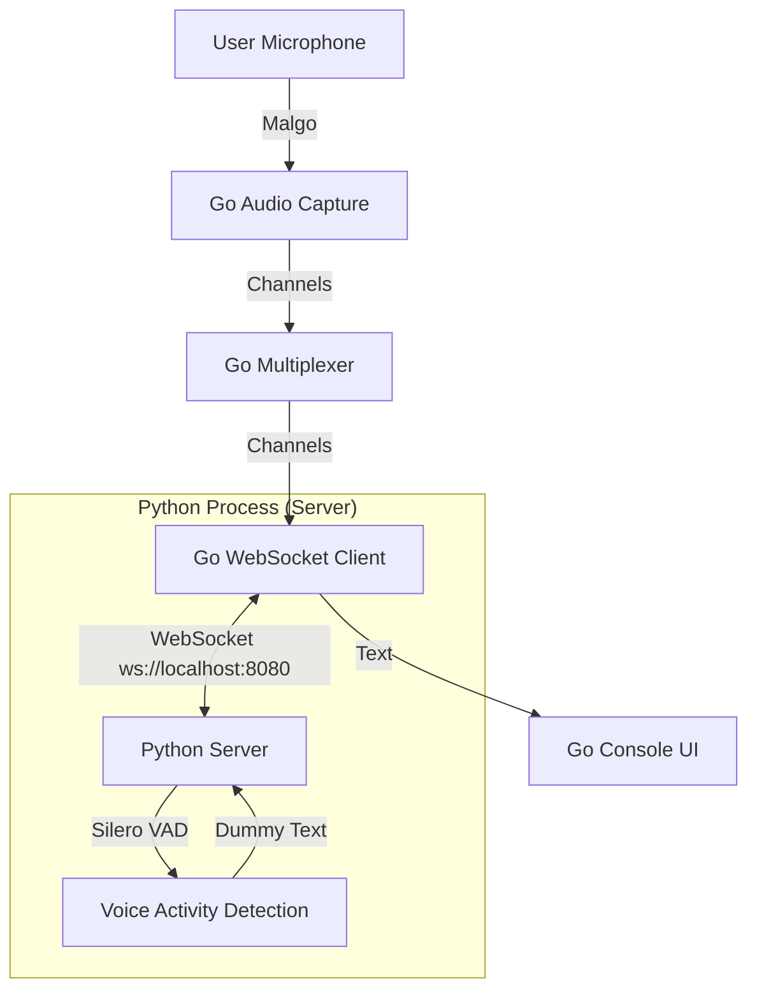

# Architecture

> Auto-generated by /map on 2026-02-11

## Overview

Livelylivecaptions is a real-time speech transcription system. The current implementation creates a bridge between a Go-based client (capturing audio) and a Python-based server (processing audio) using WebSockets.

**Note:** This implementation currently deviates from the PRD's "Zero-Dependency / Stdin-Stdout" design, involving a networked WebSocket approach instead.

## Components

### Go Components (Client)
- **Entry Point:** `cmd/livelylivecaptions/main.go`
    - Orchestrates channels and goroutines.
- **Audio:** `internal/audio`
    - Uses `malgo` (MiniAudio) to capture microphone input.
- **Network:** `internal/network`
    - Manages WebSocket connection to the Python server.
- **Multiplexer:** `internal/multiplexer`
    - Routes audio data streams.
- **UI:** `internal/ui`
    - Currently a simple `fmt.Println` output (Placeholder for TUI).
- **State:** `internal/state`
    - Manages application state.

### Python Components (Server)
- **Server:** `server.py`
    - Async WebSocket server.
    - Uses `silero-vad` for voice activity detection.
    - **Gap:** Currently returns dummy captions, no ASR model integrated yet.

## Data Flow

1. **Audio Capture:** Raw PCM data is captured from the selected microphone device.
2. **Multiplexing:** Audio data is sent to the network channel.
3. **Transmission:** Go client sends audio chunks to Python server via WebSocket.
4. **Processing:** Python server receives audio, runs VAD, and currently mocks a response.
5. **Feedback:** Text response is sent back to Go client.
6. **Display:** Go client prints the text to the console.

## Integration Points

| Service | Type | Purpose |
|---------|------|---------|
| Python Server | WebSocket | Audio Processing & Transcription Logic |
| PortAudio/MiniAudio | CGo/Library | Hardware Audio Capture |

## Technical Debt & Deviations

- **Architecture Mismatch:** Code uses WebSockets (`gorilla/websocket`), PRD specifies Stdin/Stdout pipes.
- **Missing Features:** 
    - No ASR (Sherpa/Whisper) implemented.
    - No BubbleTea TUI (simple print output).
    - No offline self-contained runner (requires starting `server.py` manually).
- **Missing Config:** No `requirements.txt` for Python dependencies.
- **Hardcoding:** Ports and buffer sizes hardcoded in `server.py` and `main.go`.

## Conventions

- **Structure:** Standard Go `cmd/`, `internal/` layout.
- **Communication:** Byte channels for audio, String channels for text.
